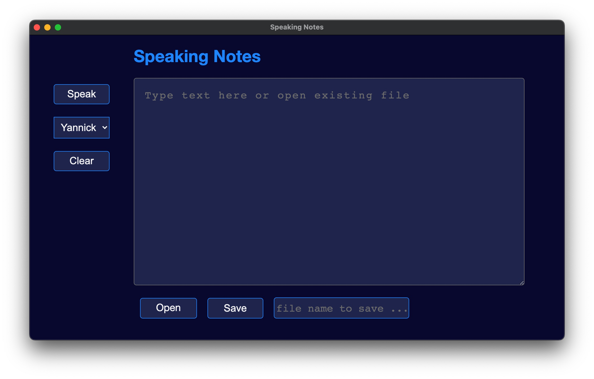

# Speaking-Notes 3.0

A lightweight and accessible notetaking-app which runs in a browser-window, uses large font-sizes and Text-To-Speech. 

It is a project for the purpose of learning only.

Unfortunately, accessing the app on Linux does not currently work with the Orca screen reader. Likewise, access to the read aloud function including voice selection is not possible


<br/>


Build with Electron React Boilerplate and Web-Speech-API and Styled-Components.


<p align = 'center'>

</p>
<br>

<p>
  Electron React Boilerplate uses <a href="https://electron.atom.io/">Electron</a>, <a href="https://facebook.github.io/react/">React</a>, <a href="https://github.com/reactjs/react-router">React Router</a>, <a href="https://webpack.js.org/">Webpack</a> and <a href="https://www.npmjs.com/package/react-refresh">React Fast Refresh</a>.
</p>

<br>

<div align="center">

[![Build Status][github-actions-status]][github-actions-url]
[![Github Tag][github-tag-image]][github-tag-url]

[![StackOverflow][stackoverflow-img]][stackoverflow-url]

</div>

## Install

Clone the repo and install dependencies:

```bash
git clone ... your-project-name
cd your-project-name
npm install
```


## Starting Development

Start the app in the `dev` environment:

```bash
npm start
```

## Packaging for Production

To package apps for the local platform:

```bash
npm run package
```

## Docs

See docs and guides for electron-react-boilerplate: [docs and guides here](https://electron-react-boilerplate.js.org/docs/installation)


## License

MIT © [Electron React Boilerplate](https://github.com/electron-react-boilerplate)

[github-actions-status]: https://github.com/electron-react-boilerplate/electron-react-boilerplate/workflows/Test/badge.svg
[github-actions-url]: https://github.com/electron-react-boilerplate/electron-react-boilerplate/actions
[github-tag-image]: https://img.shields.io/github/tag/electron-react-boilerplate/electron-react-boilerplate.svg?label=version
[github-tag-url]: https://github.com/electron-react-boilerplate/electron-react-boilerplate/releases/latest
[stackoverflow-img]: https://img.shields.io/badge/stackoverflow-electron_react_boilerplate-blue.svg
[stackoverflow-url]: https://stackoverflow.com/questions/tagged/electron-react-boilerplate


____
<p>


<a href="https://github.com/mdn/content/blob/main/files/en-us/web/api/web_speech_api/index.md">
    
</a>
<a href="https://reactjs.org">
    
</a>
<a href="https://github.com/electron-react-boilerplate/electron-react-boilerplate/releases/latest">
   
</a>
<a href="https://styled-components.com">
   
</a>

</p>
